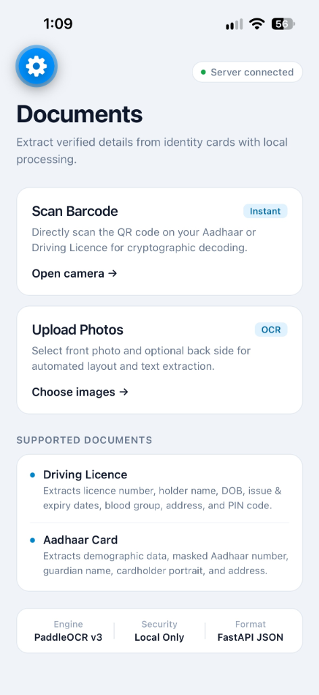
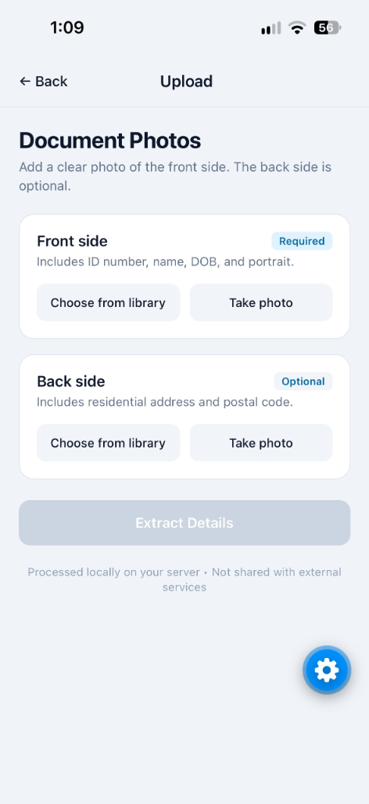

# Carta

> A clean, simple tool to scan and extract verified details from Indian Driving Licences and Aadhaar cards.

<p align="center">
  
  &nbsp;&nbsp;&nbsp;&nbsp;
  
</p>

---

## What is Carta?

**Carta** is a full-stack application that reads identity documents (Driving Licence and Aadhaar cards) and automatically extracts key details — like **Full Name, Date of Birth, ID Number, Address, and Cardholder Photo**.

It offers two simple ways to extract information:
1. **Live QR Scanning:** Point your phone camera at the QR code on an Aadhaar card or Driving Licence for instant decoding in under 50ms.
2. **Photo Upload:** Upload a clear photo of the front (and optional back) of the card. The backend uses OCR to read the text and organize it into clean fields.

Everything runs on standard laptop CPU hardware without any paid cloud APIs.

---

## Key Features

* **Instant QR Decoding:** Decompresses Aadhaar Secure QR codes using Python's `zlib` to extract verified demographic details and portrait photos without running heavy OCR.
* **Smart Layout Parsing:** Accurately pairs labels with text, correctly handling two-column tables on Driving Licences (such as distinguishing Issue Date from Expiry Date).
* **Bilingual Support:** Handles bilingual cards (English and regional scripts like Punjabi/Hindi) without letting script noise or website footers bleed into the address field.
* **Calm, Apple-Inspired UI:** A clean, minimal mobile interface built with React Native and Expo.
* **Easy Sharing:** One-tap button to copy extracted details to your clipboard or share them via native mobile share sheets.

---

## Tech Stack

* **Backend:** Python 3.12, FastAPI, Uvicorn, PaddleOCR, OpenCV, Pillow, PyZbar
* **Frontend:** React Native, Expo SDK, Expo Camera

---

## Project Structure

```text
DL-Extractor/
├── backend/
│   ├── app/
│   │   ├── routes/          # FastAPI route endpoints
│   │   ├── services/        # OCR engine, QR parser, and field extractors
│   │   ├── schemas.py       # Pydantic data models
│   │   └── main.py          # App entrypoint and startup lifecycle
│   ├── requirements.txt     # Python dependencies
│   └── verify_tests.py      # Automated backend test suite
│
├── frontend/
│   ├── screens/             # Home, Upload, and Scan screens
│   ├── components/          # ResultCard and UI components
│   ├── utils/               # Multipart image uploader
│   ├── config.js            # Backend API URL configuration
│   └── App.js               # Root navigation stack
│
└── docs/
    └── screenshots/         # App preview images
```

---

## Getting Started Locally

### Prerequisites
* **Python 3.10+** (Python 3.12 recommended)
* **Node.js 18+** and `npm`
* **Expo Go** app installed on your physical mobile phone ([iOS](https://apps.apple.com/app/expo-go/id982107779) / [Android](https://play.google.com/store/apps/details?id=host.exp.exponent)), or an emulator.

---

### Step 1: Set Up and Run the Backend

1. Open a terminal and navigate to the `backend` folder:
   ```bash
   cd backend
   ```

2. Create and activate a Python virtual environment:
   ```bash
   # On macOS/Linux:
   python3 -m venv .venv
   source .venv/bin/activate

   # On Windows (PowerShell):
   python -m venv .venv
   .venv\Scripts\Activate.ps1
   ```

3. Install the dependencies:
   ```bash
   pip install -r requirements.txt
   ```

4. Start the backend server:
   ```bash
   uvicorn app.main:app --host 0.0.0.0 --port 8000 --reload
   ```

5. The server is now running at `http://localhost:8000`.  
   You can view the interactive API documentation by opening `http://localhost:8000/docs` in your browser.

---

### Step 2: Set Up and Run the Mobile Frontend

1. Open a new terminal and navigate to the `frontend` folder:
   ```bash
   cd frontend
   ```

2. Install the JavaScript packages:
   ```bash
   npm install
   ```

3. Set your backend IP in `frontend/config.js`:
   * Find your computer's local Wi-Fi IP address (`ipconfig` on Windows, or `ifconfig` / `ip a` on Mac/Linux).
   * Open `frontend/config.js` and set:
     ```javascript
     export const API_BASE_URL = 'http://YOUR_LOCAL_IP:8000';
     ```
   *(Ensure your mobile phone and computer are on the same Wi-Fi network).*

4. Start the Expo development server:
   ```bash
   npx expo start
   ```

5. Scan the QR code shown in your terminal using the **Expo Go** app (Android) or the **Camera app** (iOS) to launch the app on your phone.

---

## Running Backend Tests

To verify that the OCR parser, QR decompressor, and API endpoints are working properly, run:

```bash
cd backend
python verify_tests.py
```

All test assertions will execute and verify the extraction pipelines.

---

